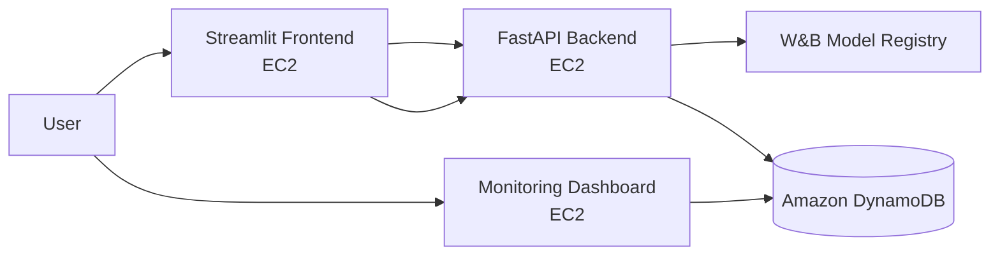

# Toxic Comment MLOps
[](https://github.com/douglas-shipman/toxic-comment-mlops/actions/workflows/ci.yml)

A production-oriented, multilabel toxic-comment moderation system implementing experiment tracking, model versioning, API serving, cloud persistence, user feedback, monitoring, automated testing, containerization, and AWS deployment.

## Live Services

> These URLs are temporary AWS Academy Learner Lab deployments and may change when the lab restarts.

- User application: http://3.83.26.225:8501
- Monitoring dashboard: http://3.228.8.125:8502
- FastAPI documentation: http://34.201.42.224:8000/docs
- Health check: http://34.201.42.224:8000/health
- W&B project: https://wandb.ai/doug_shipman-university-of-denver/toxic-comment-mlops

## Architecture



The frontend sends comments and human feedback to FastAPI. FastAPI retrieves the `production` model artifact from W&B and stores prediction telemetry in DynamoDB. The separate monitoring application reads DynamoDB directly.

## Features

- Multilabel classification across six toxicity categories
- TF-IDF text preprocessing and class-balanced logistic regression
- Reproducible train/validation splitting
- Dataset SHA-256 and Git commit tracking
- W&B experiment tracking and versioned artifacts
- Production model alias in W&B Registry
- FastAPI `/health`, `/predict`, and `/feedback` endpoints
- DynamoDB prediction and feedback persistence
- Streamlit moderation interface
- Separate Streamlit monitoring dashboard
- Unit and API integration tests
- Ruff linting and GitHub Actions CI
- Three Docker containers deployed to separate EC2 instances

## Toxicity Labels

- `toxic`
- `severe_toxic`
- `obscene`
- `threat`
- `insult`
- `identity_hate`

## Dataset

The project uses the Jigsaw Toxic Comment Classification Challenge dataset.

- Training rows: 159,571
- Source: https://www.kaggle.com/competitions/jigsaw-toxic-comment-classification-challenge
- SHA-256: `bd4084611bd27c939ba98e5e63bc3e5a2c1a4e99477dcba46c829e4c986c429d`

The raw dataset is excluded from Git. Download `train.csv` and place it at:

```text
data/raw/train.csv
```

## Baseline Results

| Metric | Score |
|---|---:|
| Macro ROC-AUC | 0.9786 |
| Micro F1 | 0.6793 |
| Macro F1 | 0.5627 |
| Micro precision | 0.5614 |
| Micro recall | 0.8599 |
| Toxic F1 | 0.7384 |
| Obscene F1 | 0.7659 |
| Insult F1 | 0.6779 |
| Threat F1 | 0.4246 |
| Severe-toxic F1 | 0.4146 |
| Identity-hate F1 | 0.3545 |

Rare classes have lower F1 scores because of substantial label imbalance. ROC-AUC and per-label F1 are reported instead of relying on accuracy alone.

## Local Setup

Requirements:

- Python 3.11
- Git
- Docker
- A W&B account
- AWS credentials when DynamoDB logging is enabled

Create and activate the environment:

```bash
python3 -m venv .venv
source .venv/bin/activate
python -m pip install --upgrade pip setuptools wheel
python -m pip install -e ".[dev]"
```

Run validation:

```bash
python -m ruff check .
python -m pytest
```

## Model Training

Authenticate with W&B:

```bash
python -c "import wandb; wandb.login()"
```

Train and register the model:

```bash
python -m toxic_mlops.training.train
```

Training records the Git commit, dataset hash, hyperparameters, split configuration, metrics, dataset manifest, and serialized model artifact.

## Run the API

Local model mode:

```bash
python -m uvicorn toxic_mlops.api.main:app --reload
```

DynamoDB and Registry mode:

```bash
export DYNAMODB_ENABLED=true
export DYNAMODB_TABLE_NAME=toxic-comment-predictions
export AWS_REGION=us-east-1
export WANDB_MODEL_ARTIFACT=doug_shipman-university-of-denver/toxic-comment-mlops/toxic-comment-classifier:production
export WANDB_API_KEY=your_secret_key

python -m uvicorn toxic_mlops.api.main:app
```

Never commit `.env`, W&B keys, AWS credentials, or PEM files.

## API Examples

Health check:

```bash
curl http://127.0.0.1:8000/health
```

Prediction:

```bash
curl -X POST http://127.0.0.1:8000/predict \
  -H "Content-Type: application/json" \
  -d '{"comment_text":"Thank you for the clear explanation."}'
```

Feedback:

```bash
curl -X POST http://127.0.0.1:8000/feedback \
  -H "Content-Type: application/json" \
  -d '{
    "request_id":"replace-with-request-id",
    "actual_labels":[]
  }'
```

An empty `actual_labels` list means the reviewer considers the comment non-toxic.

## Run the Frontend

```bash
export API_URL=http://127.0.0.1:8000
python -m streamlit run src/toxic_mlops/frontend/app.py
```

Open http://localhost:8501.

## Run Monitoring

```bash
export DYNAMODB_TABLE_NAME=toxic-comment-predictions
export AWS_REGION=us-east-1
python -m streamlit run \
  src/toxic_mlops/monitoring/app.py \
  --server.port 8502
```

Open http://localhost:8502.

The dashboard displays:

- Prediction latency over time
- Predicted class distribution
- Toxic versus non-toxic target distribution
- Feedback volume
- Feedback-based live accuracy
- Recent production activity

## Docker

Build all components:

```bash
docker build -f Dockerfile.api -t toxic-comment-api .
docker build -f Dockerfile.frontend -t toxic-comment-frontend .
docker build -f Dockerfile.monitoring -t toxic-comment-monitoring .
```

The services expose:

| Component | Port |
|---|---:|
| FastAPI | 8000 |
| User frontend | 8501 |
| Monitoring | 8502 |

## AWS Deployment

The prototype uses:

- Three Amazon Linux 2023 EC2 instances
- Docker on each EC2 instance
- `LabInstanceProfile` for AWS permissions
- DynamoDB on-demand billing
- W&B Registry for model delivery

Deployment layout:

| Instance | Component |
|---|---|
| `toxic-comment-api` | FastAPI and production model |
| `toxic-comment-frontend` | User-facing Streamlit app |
| `toxic-comment-monitoring` | Monitoring Streamlit app |

The reusable bootstrap script is located at:

```text
scripts/ec2-bootstrap.sh
```

AWS credentials are not stored in the repository or container. EC2 obtains DynamoDB access through its attached IAM instance profile.

## CI/CD

The workflow at `.github/workflows/ci.yml` triggers on:

- Pull requests targeting `main`
- Pushes to `main`

It installs the project, runs Ruff, and executes the complete pytest suite. Branch protection requires the `Lint and test` check before pull requests can merge.

## Testing

The test suite covers:

- Dataset schema validation
- Reproducible train/validation splitting
- API health checks
- Prediction responses
- Request validation
- Feedback collection
- Feedback label validation

Run:

```bash
python -m pytest
```

## Responsible AI

Toxicity moderation can cause harm through false positives, especially for reclaimed language, identity-related discussion, dialects, and comments lacking context. This system therefore:

- Returns probabilities rather than only opaque labels
- Supports human review and correction
- Tracks feedback-based production accuracy
- Does not automatically remove content
- Preserves a review workflow for uncertain cases

Raw comments may contain sensitive or offensive content. A real production system should define retention limits, encryption, access controls, and deletion policies.

## Known Limitations

- The baseline model uses word-level TF-IDF and does not deeply understand context.
- A fixed `0.5` threshold is used for every label.
- Rare classes have weaker F1 performance.
- The monitoring implementation scans DynamoDB and would need pagination indexes or aggregation jobs at high scale.
- The AWS Academy URLs and credentials are temporary.
- HTTPS, authentication, rate limiting, and automated retraining are future production improvements.

## Continual-Learning Path

The feedback records support this future workflow:

```text
prediction → feedback → curation → retraining → evaluation
→ Registry candidate → production promotion → deployment
```

Promotion remains manual so a newly trained model cannot reach production without evaluation and review.